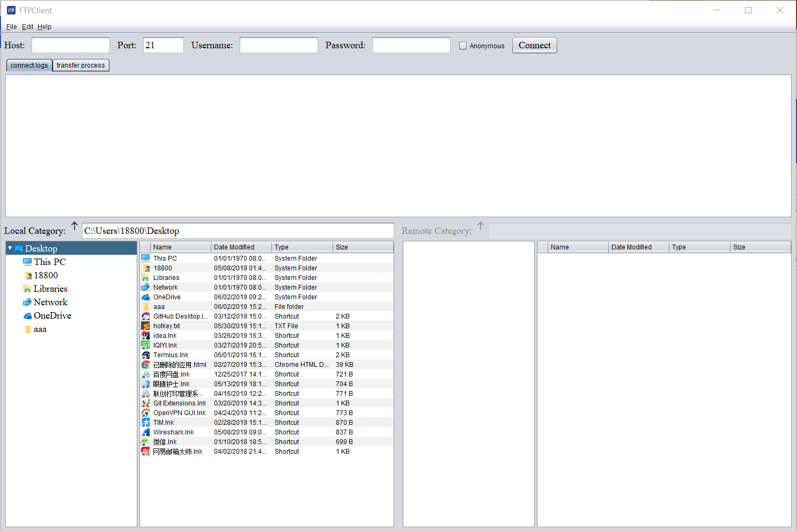
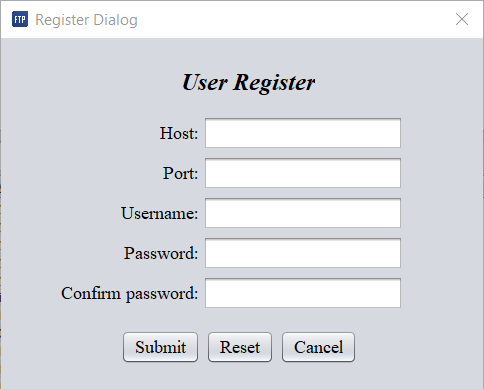
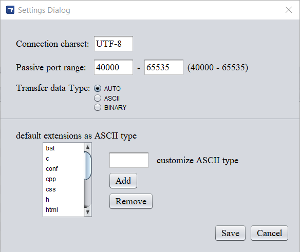
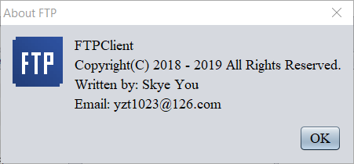
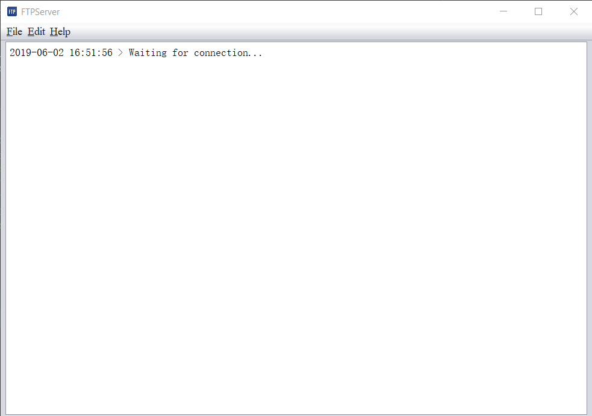
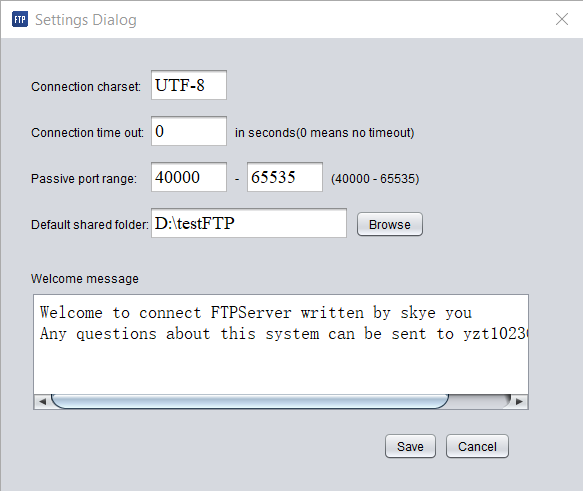
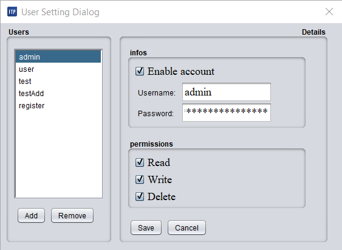
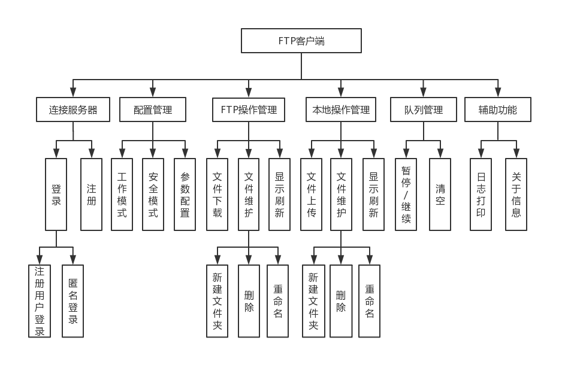
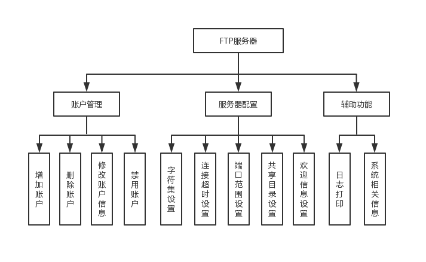
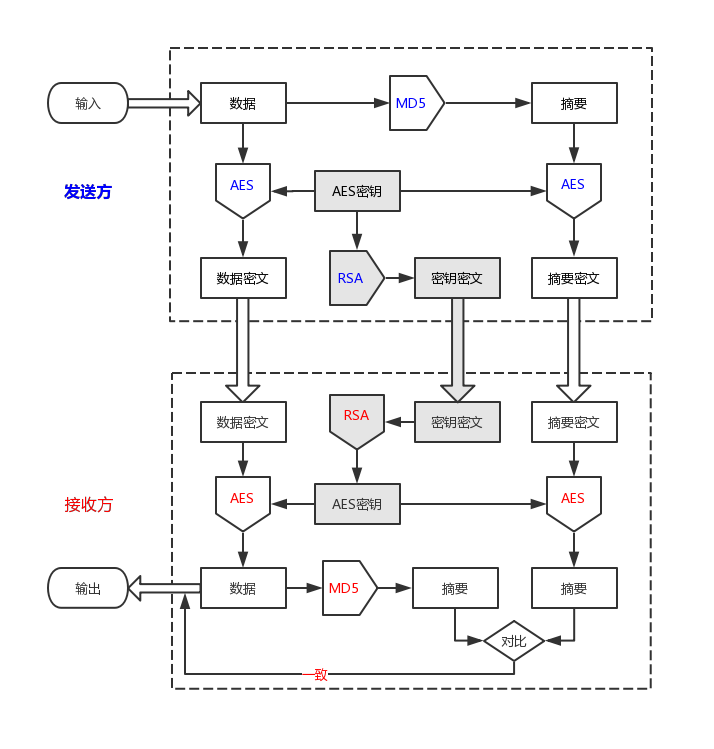

# FTP
The graduation project: implementation of file transfer system supporting breakpoint retransmission

## UI
The project consists of two parts: client and server.

### client ui

The following figure is the main pane of client

This project provide user registration function

Next figure is used for users to modify configuration parameters

There is "about dialog" in both client and server

### server ui

The server main panel mainly contains a text area to record communication message

The server also provides a configuration parameter modification dialog.

The server provides comprehensive user management function

## Project functional structure

Detailed project functions are listed in the functional structure diagram

The network security communication model used by the project is shown in the figure below, which includes the encryption algorithms Base64, MD5, AES and RSA.

